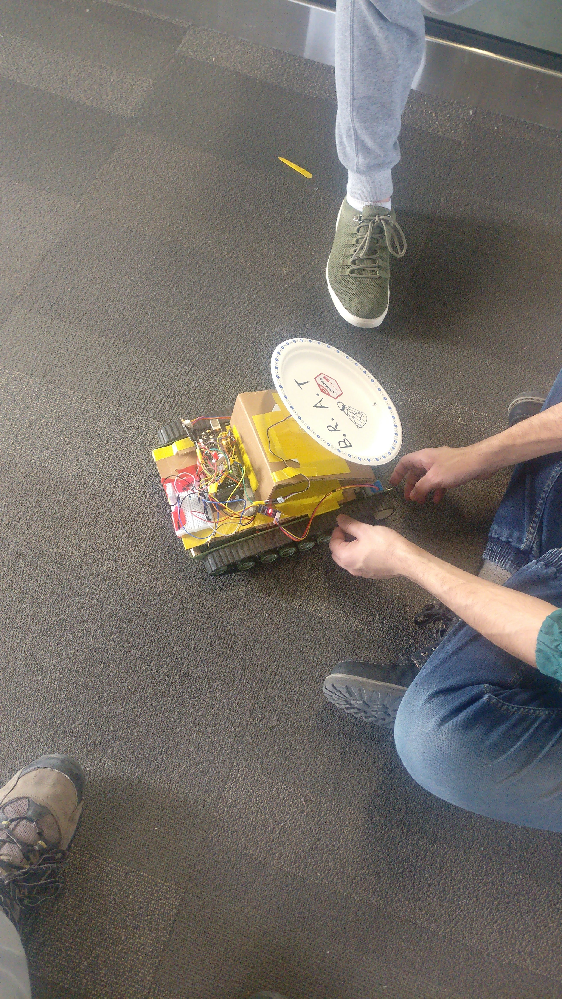

Badminton Bot (BRAT)

- A badminton robotic automous trainer. Use the mobile App to select location on the opposite side of the court and the number of shots you want to take. The data will be uploaded to the robot via bluetooth. The robot will then move to each location. The user will shoot the birdies at the robot target. The robot will measure if the birdie hit successfully and pass the shooting data to the mobile app

Instructions to Run:
- Install the Android app through Android studio
- Run the Arduino code on the robot by simply using an Arduino IDE and uploading the code

Components

1. Robot
- Built using an Arduino and multiple components (C# and C++)
Bluetooth: Connects to the Android app via bluetooth to upload/download data
Accelometer: Measures whether the birdie hit the target
Motor System: Uses stepper motors to control the robots exact location on the court

2. Android App
- Built using Kotlin
- Allows selection of locations on a badminton court
- Connects to the robot via bluetooth

BRAT at work:  

